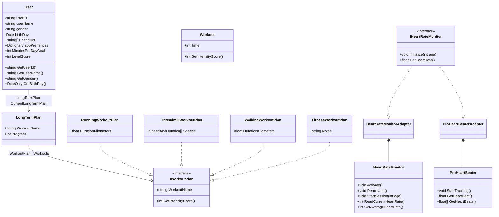

# Class diagram

## LevelScore
This is a variable that tracks the userś level, to assist in
generating workouts. It remains invisible as to not rank people 
based on their fitness, going agains the friendly nature of the app. 

## GetIntensityScore()
Get a score judging t

## SpeedAndDuration
This type is used in the ThreadmillWorkoutPlan. 
We first wanted to use a tuple, but the UML software would'nt let us
type < or >. 