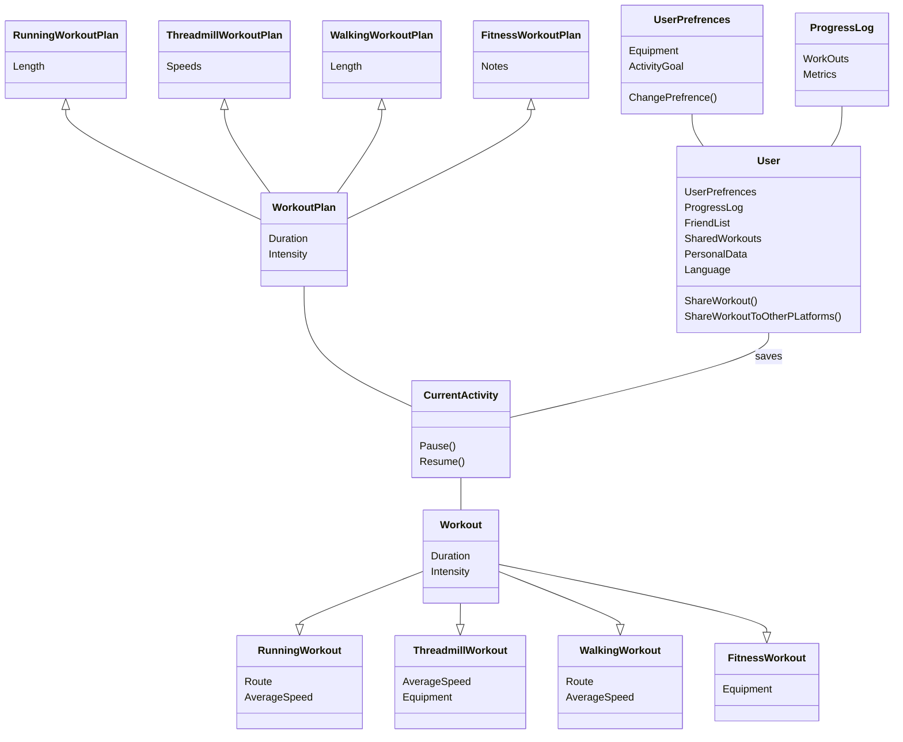
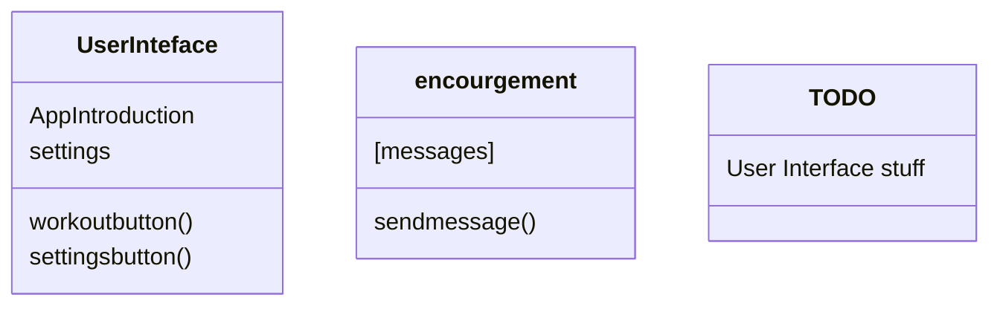

# Domain model

```mermaid
classDiagram
    class Workout{
      Duration
      Intensity 
    }
    Workout --|> RunningWorkout
    class RunningWorkout{
      Route
      AverageSpeed
    }
    Workout --|> ThreadmillWorkout 
    class ThreadmillWorkout{
      AverageSpeed
      Equipment
    }
    Workout --|> WalkingWorkout 
    class WalkingWorkout{
      Route
      AverageSpeed
    }
    Workout --|> FitnessWorkout 
    class FitnessWorkout{
      Equipment
    }

    class WorkoutPlan{
      Duration
      Intensity 
    }
    RunningWorkoutPlan <|-- WorkoutPlan
    class RunningWorkoutPlan{
      Length
    }
    ThreadmillWorkoutPlan <|-- WorkoutPlan
    class ThreadmillWorkoutPlan{
      Speeds
    }
    WalkingWorkoutPlan <|-- WorkoutPlan
    class WalkingWorkoutPlan{
      Length
    }
    FitnessWorkoutPlan <|-- WorkoutPlan
    class FitnessWorkoutPlan{
      Notes
    }
    WorkoutPlan -- CurrentActivity
    CurrentActivity -- Workout
    class CurrentActivity{
      Pause()
      Resume()
    }

    class UserPrefrences{
      Equipment
      ActivityGoal
      ChangePrefrence()
    }

    class ProgressLog{
      WorkOuts
      Metrics
    }
    UserPrefrences -- User
    ProgressLog -- User
    User -- CurrentActivity :saves
    class User{
      UserPrefrences
      ProgressLog
      FriendList
      SharedWorkouts
      PersonalData
      Language
      ShareWorkout()
      ShareWorkoutToOtherPLatforms()
    }
```

```mermaid
  classDiagram
    class UserInteface{
      AppIntroduction
      settings
      workoutbutton()
      settingsbutton()
      
    }
    class encourgement{
      [messages]
      sendmessage()
    }


    class TODO{
      User Interface stuff
    }
```