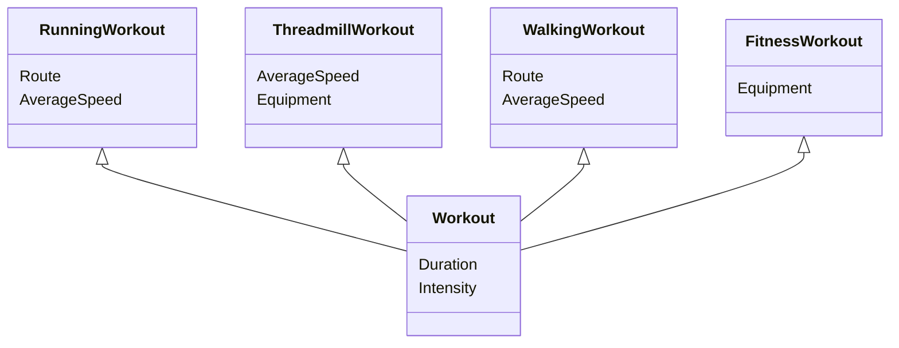
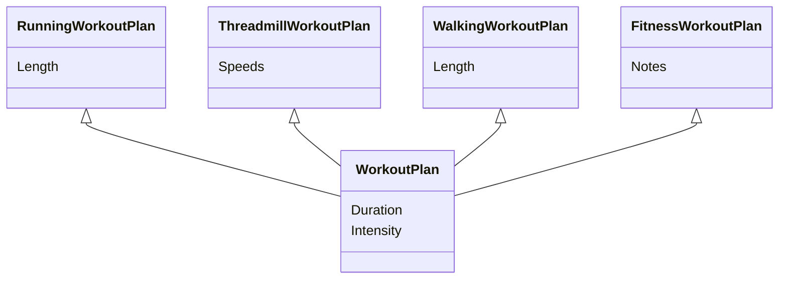
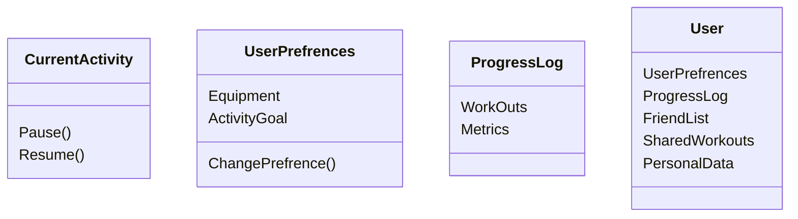
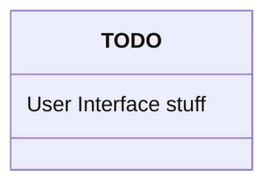

# Domain model

```mermaid
classDiagram
    class Workout{
      Duration
      Intensity 
    }
    RunningWorkout <|-- Workout
    class RunningWorkout{
      Route
      AverageSpeed
    }
    ThreadmillWorkout <|-- Workout
    class ThreadmillWorkout{
      AverageSpeed
      Equipment
    }
    WalkingWorkout <|-- Workout
    class WalkingWorkout{
      Route
      AverageSpeed
    }
    FitnessWorkout <|-- Workout
    class FitnessWorkout{
      Equipment
    }
```

```mermaid
  classDiagram

    class WorkoutPlan{
      Duration
      Intensity 
    }
    RunningWorkoutPlan <|-- WorkoutPlan
    class RunningWorkoutPlan{
      Length
    }
    ThreadmillWorkoutPlan <|-- WorkoutPlan
    class ThreadmillWorkoutPlan{
      Speeds
    }
    WalkingWorkoutPlan <|-- WorkoutPlan
    class WalkingWorkoutPlan{
      Length
    }
    FitnessWorkoutPlan <|-- WorkoutPlan
    class FitnessWorkoutPlan{
      Notes
    }
```

```mermaid
  classDiagram
    class CurrentActivity{
      Pause()
      Resume()
    }

    class UserPrefrences{
      Equipment
      ActivityGoal
      ChangePrefrence()
    }

    class ProgressLog{
      WorkOuts
      Metrics
    }
  
    class User{
      UserPrefrences
      ProgressLog
      FriendList
      SharedWorkouts
      PersonalData
    }
```

```mermaid
  classDiagram
    class TODO{
      User Interface stuff
    }
```