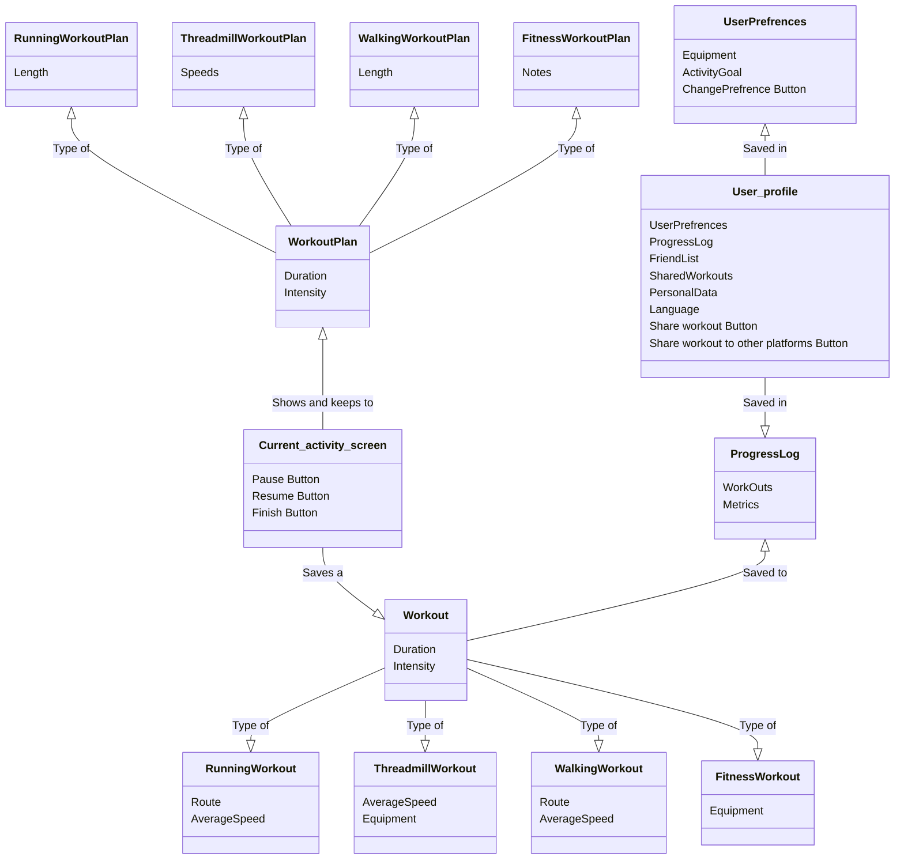

# Domain model

```mermaid
classDiagram
    class Workout{
      Duration
      Intensity 
    }
    Workout --|> RunningWorkout : Type of
    class RunningWorkout{
      Route
      AverageSpeed
    }
    Workout --|> ThreadmillWorkout  : Type of
    class ThreadmillWorkout{
      AverageSpeed
      Equipment
    }
    Workout --|> WalkingWorkout : Type of
    class WalkingWorkout{
      Route
      AverageSpeed
    }
    Workout --|> FitnessWorkout : Type of
    class FitnessWorkout{
      Equipment
    }

    class WorkoutPlan{
      Duration
      Intensity 
    }
    RunningWorkoutPlan <|-- WorkoutPlan : Type of

    class RunningWorkoutPlan{
      Length
    }
    ThreadmillWorkoutPlan <|-- WorkoutPlan : Type of

    class ThreadmillWorkoutPlan{
      Speeds
    }
    WalkingWorkoutPlan <|-- WorkoutPlan : Type of

    class WalkingWorkoutPlan{
      Length
    }
    FitnessWorkoutPlan <|-- WorkoutPlan : Type of

    class FitnessWorkoutPlan{
      Notes
    }
    WorkoutPlan <|-- Current_activity_screen : Shows and keeps to
    Current_activity_screen --|> Workout : Saves a
    class Current_activity_screen{
      Pause Button
      Resume Button
      Finish Button
    }

    class UserPrefrences{
      Equipment
      ActivityGoal
      ChangePrefrence Button
    }

    class ProgressLog{
      WorkOuts
      Metrics
    }
    UserPrefrences <|-- User_profile: Saved in
    User_profile --|> ProgressLog : Saved in
    ProgressLog <|-- Workout: Saved to
    class User_profile{
      UserPrefrences
      ProgressLog
      FriendList
      SharedWorkouts
      PersonalData
      Language
      Share workout Button
      Share workout to other platforms Button
    }


```